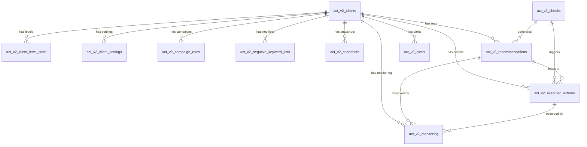

# ACT v2 Database Schema

## Overview

The ACT v2 schema is the foundation for the new optimization engine, replacing the old 75-rule system. It supports the v54 architecture document across all 6 optimization levels: Account, Campaign, Ad Group, Keyword, Ad, and Shopping.

All tables are prefixed `act_v2_` to coexist with the existing tables. The old engine tables (`rules`, `flags`, `recommendations`, `changes`) remain untouched.

**Database:** DuckDB (`warehouse.duckdb` at project root)
**Timestamps:** All UTC naive (`TIMESTAMP` type)

---

## Table List

### Client Configuration (5 tables)
| Table | Purpose |
|-------|---------|
| `act_v2_clients` | Client accounts managed by ACT v2 with persona, budget, and targets |
| `act_v2_client_level_state` | Per-client, per-level activation state (Off / Monitor Only / Active) |
| `act_v2_client_settings` | 45 optimization tunables per client, organized by level |
| `act_v2_campaign_roles` | Campaign role assignments (BD / CP / RT / PR / TS) |
| `act_v2_negative_keyword_lists` | 9 standardized negative keyword lists per client |

### Data Ingestion (1 table)
| Table | Purpose |
|-------|---------|
| `act_v2_snapshots` | Daily snapshots of Google Ads data at all entity levels |

### Engine Reference (1 table)
| Table | Purpose |
|-------|---------|
| `act_v2_checks` | 35 check definitions across all levels (populated from v54 spec) |

### Engine Output (4 tables)
| Table | Purpose |
|-------|---------|
| `act_v2_recommendations` | Recommendations generated by the engine for human or auto approval |
| `act_v2_executed_actions` | Log of actions executed via Google Ads API |
| `act_v2_monitoring` | Post-action observation and cooldown tracking |
| `act_v2_alerts` | Alerts raised by engine checks for human attention |

---

## Entity Relationship Diagram



---

## Table Details

### act_v2_clients

Client accounts managed by ACT v2. Each client maps to one Google Ads customer ID.

| Column | Type | Constraints | Default | Purpose |
|--------|------|-------------|---------|---------|
| client_id | VARCHAR | PK | — | Internal client identifier (e.g. 'oe001') |
| google_ads_customer_id | VARCHAR(20) | UNIQUE NOT NULL | — | Google Ads customer ID (no dashes) |
| client_name | VARCHAR(500) | NOT NULL | — | Display name |
| persona | VARCHAR(50) | NOT NULL, CHECK | — | 'lead_gen_cpa' or 'ecommerce_roas' |
| monthly_budget | DECIMAL(18,2) | NOT NULL | — | Monthly ad spend budget |
| target_cpa | DECIMAL(10,2) | — | — | Target CPA (lead_gen only) |
| target_roas | DECIMAL(10,2) | — | — | Target ROAS (ecommerce only) |
| active | BOOLEAN | NOT NULL | TRUE | Whether client is active |
| created_at | TIMESTAMP | NOT NULL | CURRENT_TIMESTAMP | Record creation time |
| updated_at | TIMESTAMP | NOT NULL | CURRENT_TIMESTAMP | Last update (set manually) |

CHECK constraint enforces that lead_gen clients have target_cpa (no target_roas) and ecommerce clients have target_roas (no target_cpa).

**Example INSERT:**
```sql
INSERT INTO act_v2_clients
(client_id, google_ads_customer_id, client_name, persona, monthly_budget, target_cpa)
VALUES ('oe001', '8530211223', 'Objection Experts', 'lead_gen_cpa', 1500.00, 25.00);
```

**Common queries:**
```sql
-- Get all active clients
SELECT * FROM act_v2_clients WHERE active = TRUE;

-- Get client by Google Ads ID
SELECT * FROM act_v2_clients WHERE google_ads_customer_id = '8530211223';
```

### act_v2_client_level_state

Per-client, per-level activation state controlling whether ACT runs checks.

| Column | Type | Constraints | Default | Purpose |
|--------|------|-------------|---------|---------|
| client_id | VARCHAR | PK, FK→clients | — | Client reference |
| level | VARCHAR(20) | PK, CHECK | — | Optimization level |
| state | VARCHAR(20) | NOT NULL, CHECK | 'off' | off / monitor_only / active |
| updated_at | TIMESTAMP | NOT NULL | CURRENT_TIMESTAMP | Last state change |
| updated_by | VARCHAR(100) | NOT NULL | 'system' | Who changed the state |

**Example INSERT:**
```sql
INSERT INTO act_v2_client_level_state (client_id, level, state, updated_by)
VALUES ('oe001', 'campaign', 'active', 'chris');
```

### act_v2_client_settings

45 optimization tunables per client. Values stored as strings, interpreted by type.

| Column | Type | Constraints | Default | Purpose |
|--------|------|-------------|---------|---------|
| client_id | VARCHAR | PK, FK→clients | — | Client reference |
| setting_key | VARCHAR(100) | PK | — | Setting identifier |
| setting_value | VARCHAR | — | — | Value as string |
| setting_type | VARCHAR(20) | NOT NULL, CHECK | — | int/decimal/bool/string/json |
| level | VARCHAR(20) | NOT NULL, CHECK | — | Which level this setting applies to |
| updated_at | TIMESTAMP | NOT NULL | CURRENT_TIMESTAMP | Last update |

**Example INSERT:**
```sql
INSERT INTO act_v2_client_settings (client_id, setting_key, setting_value, setting_type, level)
VALUES ('oe001', 'device_mod_min_pct', '-60', 'int', 'campaign');
```

### act_v2_campaign_roles

Assigns strategic roles to campaigns for budget allocation and optimization behavior.

| Column | Type | Constraints | Default | Purpose |
|--------|------|-------------|---------|---------|
| client_id | VARCHAR | PK, FK→clients | — | Client reference |
| google_ads_campaign_id | VARCHAR(30) | PK | — | Google Ads campaign ID |
| campaign_name | VARCHAR(500) | — | — | Campaign display name |
| role | VARCHAR(10) | NOT NULL, CHECK | — | BD/CP/RT/PR/TS |
| role_assigned_by | VARCHAR(100) | NOT NULL | 'auto' | auto or manual |
| updated_at | TIMESTAMP | NOT NULL | CURRENT_TIMESTAMP | Last update |

Roles: BD = Brand Defence, CP = Core Performance, RT = Retargeting, PR = Prospecting, TS = Testing.

### act_v2_negative_keyword_lists

9 standardized negative keyword lists per client, organized by word count and match type.

| Column | Type | Constraints | Default | Purpose |
|--------|------|-------------|---------|---------|
| list_id | VARCHAR | PK | — | List identifier (e.g. 'oe001-list-1word-exact') |
| client_id | VARCHAR | NOT NULL, FK→clients | — | Client reference |
| google_ads_list_id | VARCHAR(30) | — | — | Google Ads shared list ID (after API sync) |
| list_name | VARCHAR(100) | NOT NULL | — | Display name |
| word_count | INTEGER | NOT NULL, CHECK | — | 1-5 (5 means 5+) |
| match_type | VARCHAR(20) | NOT NULL, CHECK | — | exact or phrase |
| keyword_count | INTEGER | NOT NULL | 0 | Number of keywords in list |
| last_synced_at | TIMESTAMP | — | — | Last sync with Google Ads |

### act_v2_snapshots

Daily snapshots of Google Ads data. `metrics_json` stores level-specific metrics.

| Column | Type | Constraints | Default | Purpose |
|--------|------|-------------|---------|---------|
| snapshot_id | BIGINT | PK | nextval(seq) | Auto-incrementing ID |
| client_id | VARCHAR | NOT NULL, FK→clients | — | Client reference |
| snapshot_date | DATE | NOT NULL | — | Date of the snapshot |
| level | VARCHAR(20) | NOT NULL, CHECK | — | Entity level (note: uses 'product' not 'shopping') |
| entity_id | VARCHAR(100) | NOT NULL | — | Google Ads entity ID |
| entity_name | VARCHAR(500) | — | — | Entity display name |
| parent_entity_id | VARCHAR(100) | — | — | Parent entity (e.g. campaign for ad group) |
| metrics_json | JSON | — | — | All performance metrics for this entity |
| created_at | TIMESTAMP | NOT NULL | CURRENT_TIMESTAMP | Record creation time |

**Index:** `idx_act_v2_snapshots_lookup` on (client_id, snapshot_date, level, entity_id)

### act_v2_checks

35 check definitions from the v54 architecture. Populated once, rarely changes.

| Column | Type | Constraints | Default | Purpose |
|--------|------|-------------|---------|---------|
| check_id | VARCHAR(100) | PK | — | Check identifier (e.g. 'campaign_device_modifiers') |
| level | VARCHAR(20) | NOT NULL, CHECK | — | Optimization level |
| check_name | VARCHAR(200) | NOT NULL | — | Human-readable name |
| description | VARCHAR | — | — | One-line description of what the check does |
| action_category | VARCHAR(20) | NOT NULL, CHECK | — | act/monitor/investigate/alert |
| auto_execute | BOOLEAN | NOT NULL | FALSE | Whether this check can auto-execute |
| cooldown_hours | INTEGER | — | — | Cooldown between executions (NULL = no cooldown) |
| active | BOOLEAN | NOT NULL | TRUE | Whether check is active |

### act_v2_recommendations

Recommendations generated by the engine for human review or auto-execution.

| Column | Type | Constraints | Default | Purpose |
|--------|------|-------------|---------|---------|
| recommendation_id | BIGINT | PK | nextval(seq) | Auto-incrementing ID |
| client_id | VARCHAR | NOT NULL, FK→clients | — | Client reference |
| level | VARCHAR(20) | NOT NULL, CHECK | — | Optimization level |
| check_id | VARCHAR(100) | NOT NULL, FK→checks | — | Which check generated this |
| entity_id | VARCHAR(100) | NOT NULL | — | Google Ads entity being optimized |
| entity_name | VARCHAR(500) | — | — | Entity display name |
| parent_entity_id | VARCHAR(100) | — | — | Parent entity |
| action_category | VARCHAR(20) | NOT NULL, CHECK | — | act/monitor/investigate/alert |
| risk_level | VARCHAR(20) | NOT NULL, CHECK | — | low/medium/high |
| summary | VARCHAR | NOT NULL | — | Brief description of the recommendation |
| recommendation_text | VARCHAR | — | — | Detailed recommendation |
| estimated_impact | VARCHAR | — | — | Expected impact description |
| decision_tree_json | JSON | — | — | Decision tree path that led here |
| current_value_json | JSON | — | — | Current state of the entity |
| proposed_value_json | JSON | — | — | Proposed changes |
| status | VARCHAR(20) | NOT NULL, CHECK | 'pending' | pending/approved/declined/executed/rolled_back/expired |
| mode | VARCHAR(20) | NOT NULL, CHECK | 'active' | active or monitor_only |
| identified_at | TIMESTAMP | NOT NULL | CURRENT_TIMESTAMP | When this was identified |
| actioned_at | TIMESTAMP | — | — | When action was taken |
| actioned_by | VARCHAR(100) | — | — | Who actioned it |

**Index:** `idx_act_v2_recs_client_status` on (client_id, status, identified_at)

### act_v2_executed_actions

Log of actions executed via Google Ads API, linked to recommendations.

| Column | Type | Constraints | Default | Purpose |
|--------|------|-------------|---------|---------|
| action_id | BIGINT | PK | nextval(seq) | Auto-incrementing ID |
| client_id | VARCHAR | NOT NULL, FK→clients | — | Client reference |
| recommendation_id | BIGINT | FK→recommendations | — | Source recommendation (if any) |
| level | VARCHAR(20) | NOT NULL, CHECK | — | Optimization level |
| check_id | VARCHAR(100) | NOT NULL, FK→checks | — | Which check triggered this |
| entity_id | VARCHAR(100) | NOT NULL | — | Google Ads entity modified |
| entity_name | VARCHAR(500) | — | — | Entity display name |
| action_type | VARCHAR(50) | NOT NULL | — | Type of action (e.g. 'bid_adjustment') |
| before_value_json | JSON | — | — | State before the action |
| after_value_json | JSON | — | — | State after the action |
| reason | VARCHAR | — | — | Why this action was taken |
| execution_status | VARCHAR(20) | NOT NULL, CHECK | 'pending' | success/failed/pending |
| error_message | VARCHAR | — | — | Error details if failed |
| executed_at | TIMESTAMP | NOT NULL | CURRENT_TIMESTAMP | When executed |
| google_ads_api_response | JSON | — | — | Raw API response |

**Index:** `idx_act_v2_actions_client_date` on (client_id, executed_at)

### act_v2_monitoring

Post-action observation and cooldown tracking. Records kept permanently.

| Column | Type | Constraints | Default | Purpose |
|--------|------|-------------|---------|---------|
| monitoring_id | BIGINT | PK | nextval(seq) | Auto-incrementing ID |
| client_id | VARCHAR | NOT NULL, FK→clients | — | Client reference |
| recommendation_id | BIGINT | FK→recommendations | — | Source recommendation |
| action_id | BIGINT | FK→executed_actions | — | Source action |
| level | VARCHAR(20) | NOT NULL, CHECK | — | Optimization level |
| entity_id | VARCHAR(100) | NOT NULL | — | Entity being monitored |
| monitoring_type | VARCHAR(30) | NOT NULL, CHECK | — | cooldown/post_action_observation/trend_watch |
| started_at | TIMESTAMP | NOT NULL | CURRENT_TIMESTAMP | When monitoring began |
| ends_at | TIMESTAMP | NOT NULL | — | When monitoring should end |
| resolved_at | TIMESTAMP | — | — | When monitoring completed (NULL = active) |
| health_status | VARCHAR(30) | NOT NULL, CHECK | 'too_early_to_assess' | healthy/trending_down/too_early_to_assess |
| consecutive_days_stable | INTEGER | NOT NULL | 0 | Days of stable performance |
| metrics_json | JSON | — | — | Tracked metrics over time |

**Index:** `idx_act_v2_monitoring_active` on (client_id, resolved_at)

### act_v2_alerts

Alerts raised by engine checks requiring human attention.

| Column | Type | Constraints | Default | Purpose |
|--------|------|-------------|---------|---------|
| alert_id | BIGINT | PK | nextval(seq) | Auto-incrementing ID |
| client_id | VARCHAR | NOT NULL, FK→clients | — | Client reference |
| level | VARCHAR(20) | NOT NULL, CHECK | — | Optimization level |
| alert_type | VARCHAR(50) | NOT NULL | — | Alert category |
| severity | VARCHAR(20) | NOT NULL, CHECK | — | info/warning/critical |
| title | VARCHAR | NOT NULL | — | Alert headline |
| description | VARCHAR | — | — | Detailed description |
| entity_id | VARCHAR(100) | — | — | Related entity |
| raised_at | TIMESTAMP | NOT NULL | CURRENT_TIMESTAMP | When raised |
| resolved_at | TIMESTAMP | — | — | When resolved (NULL = active) |
| resolution | VARCHAR(30) | CHECK | — | acknowledged/auto_resolved/approved_fix |

**Index:** `idx_act_v2_alerts_client` on (client_id, resolved_at, raised_at)

---

## Workflow Examples

### New Client Onboarding
1. Insert client into `act_v2_clients` with persona, budget, and target
2. Insert 6 level states into `act_v2_client_level_state` (all `'off'`)
3. Insert 45 default settings into `act_v2_client_settings`
4. Create 9 negative keyword list entries in `act_v2_negative_keyword_lists`
5. Activate levels as needed by updating `act_v2_client_level_state`

### Recommendation Lifecycle
1. Engine runs a check (e.g. `campaign_device_modifiers`)
2. Check identifies an issue → inserts into `act_v2_recommendations` with `status='pending'`
3. If `auto_execute=TRUE` and `action_category='act'` → engine auto-approves, sets `status='approved'`
4. Execution layer calls Google Ads API → inserts into `act_v2_executed_actions`
5. Recommendation status updated to `'executed'`
6. Monitoring entry created in `act_v2_monitoring` with type `'post_action_observation'`

### Post-Action Monitoring
1. `act_v2_monitoring` entry created with `monitoring_type='cooldown'` or `'post_action_observation'`
2. Engine checks `health_status` daily against new snapshot data
3. If metrics stable → `health_status='healthy'`, increment `consecutive_days_stable`
4. If metrics declining → `health_status='trending_down'`, may trigger rollback recommendation
5. When monitoring period ends → set `resolved_at`

### Alert Lifecycle
1. Engine check raises alert → inserts into `act_v2_alerts` with severity
2. Alert appears on dashboard for human review
3. Human acknowledges → set `resolved_at` and `resolution='acknowledged'`
4. Or engine auto-resolves if condition clears → `resolution='auto_resolved'`

---

## Important Notes

### DuckDB-Specific Quirks
- **No `ON UPDATE CURRENT_TIMESTAMP`** — `updated_at` must be set manually in application code
- **No partial indexes** — all indexes are regular (filter in queries instead)
- **No `AUTO_INCREMENT`** — uses `CREATE SEQUENCE` + `nextval()`
- **Foreign keys** — declared for documentation, but enforcement varies by DuckDB version; validate in application code
- **`INSERT OR REPLACE`** — has issues with tables that have multiple UNIQUE constraints and FK references; use check-then-insert pattern instead

### JSON Columns
JSON columns (`metrics_json`, `decision_tree_json`, `current_value_json`, `proposed_value_json`, `before_value_json`, `after_value_json`, `google_ads_api_response`) store structured data. DuckDB supports JSON as a first-class type with native query functions.

### Level Values
- Most tables use: `account`, `campaign`, `ad_group`, `keyword`, `ad`, `shopping`
- `act_v2_snapshots` uses `product` instead of `shopping` (individual product entities vs optimization level)

---

## Future Considerations

### Partitioning Strategy for Snapshots
`act_v2_snapshots` will grow large with multiple clients. Consider partitioning by `client_id` + `snapshot_date` when scaling beyond a few clients.

### Archive Strategy
Old recommendations (status `executed`, `declined`, `expired`) can be archived to a separate table after 90 days to keep the main table fast for dashboard queries.

### Migration to PostgreSQL
If scaling requires it, the schema is designed to be portable. Key changes needed:
- Replace `CREATE SEQUENCE` + `nextval()` with `SERIAL` or `BIGSERIAL`
- Add `ON UPDATE CURRENT_TIMESTAMP` triggers for `updated_at`
- Convert partial index workarounds to actual partial indexes
- JSON type maps directly to PostgreSQL `JSONB`
